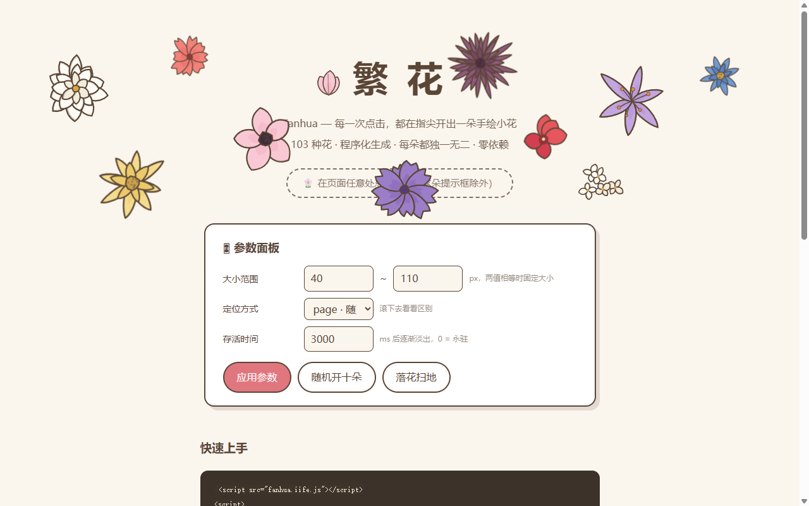

# 繁花 Fanhua 🌸

> 每一次点击，都在指尖开出一朵手绘小花。

繁花是一个零依赖的原生 JS 插件：点击页面任意位置，点击处会随机绽放一朵程序化生成的手绘风格小花。18 种花型 × 16 组蜡笔配色，共 **103 个命名花种**，而且每朵花的轮廓、花瓣、勾线都由随机种子驱动——即使是同一种花，也不会有两朵一模一样。



## 特性

- 🎨 **手绘感**：花瓣由带抖动的贝塞尔曲线勾勒，很多花瓣会被"铅笔"再淡淡勾一道
- 🌼 **103 种花**：雏菊、玫瑰、樱花、向日葵、郁金香、绣球、风铃草……点击时随机抽选
- 📐 **大小可定制**：支持区间随机或固定大小
- 📌 **两种定位**：跟随页面滚动，或固定在屏幕上
- ⏳ **可控存活时间**：到时逐渐淡出，也可以选择永驻
- 📦 **零依赖**：~6KB min+gzip，ESM / CJS / IIFE 三种格式

## 安装

```bash
npm install fanhua
```

或直接用 `<script>` 标签引入 IIFE 版本：

```html
<script src="dist/fanhua.iife.js"></script>
```

## 快速上手

```js
// ESM
import Fanhua from 'fanhua'

// 浏览器全局（IIFE）
window.Fanhua

Fanhua.init({
  size: [40, 110],   // 大小范围（px）；也可以传单个数字如 80 表示固定大小
  position: 'page',  // 'page' 随页面滚动 | 'screen' 固定在屏幕上
  duration: 3000,    // 绽放多少毫秒后逐渐淡出；0 = 永驻
})
```

搞定——现在点击页面任意处都会开花。

## API

### `Fanhua.init(options?)`

绑定点击监听并应用配置，重复调用会合并配置。

| 参数 | 类型 | 默认值 | 说明 |
|------|------|--------|------|
| `size` | `number \| [number, number]` | `[40, 110]` | 单个数字 = 每朵花固定为该大小；两个数字 = 在 `[min, max]` 区间内随机 |
| `position` | `'page' \| 'screen'` | `'page'` | `page`：花落在文档上，随页面滚动；`screen`：花钉在视口上，不随滚动移动 |
| `duration` | `number` | `3000` | 绽放多少毫秒后开始逐渐淡出；`0` = 永驻不消失 |
| `zIndex` | `number` | `2147483647` | 花朵的层叠层级 |

### `Fanhua.setOptions(options?)`

随时更新配置，不必重新 `init`。

```js
Fanhua.setOptions({ duration: 0 }) // 之后开的花永驻
```

### `Fanhua.bloom(clientX, clientY, overrides?)`

在指定视口坐标手动开一朵花，第三个参数可临时覆盖任意配置。

```js
Fanhua.bloom(innerWidth / 2, innerHeight / 2, { size: 120 })
```

### `Fanhua.clear()`

清掉页面上所有的花。

### `Fanhua.destroy()`

移除点击监听（已开的花保留）。

### `Fanhua.FLOWER_COUNT`

当前花种总数。

## 本地开发

```bash
npm install
npm run build   # 打包 dist/
npm test        # 花种生成自检
npm run serve   # 启动 demo：http://localhost:4173
```

打开 demo 后点击页面任意处即可看效果，面板可以实时调整大小范围、定位方式与存活时间。

## License

[MIT](./LICENSE)
